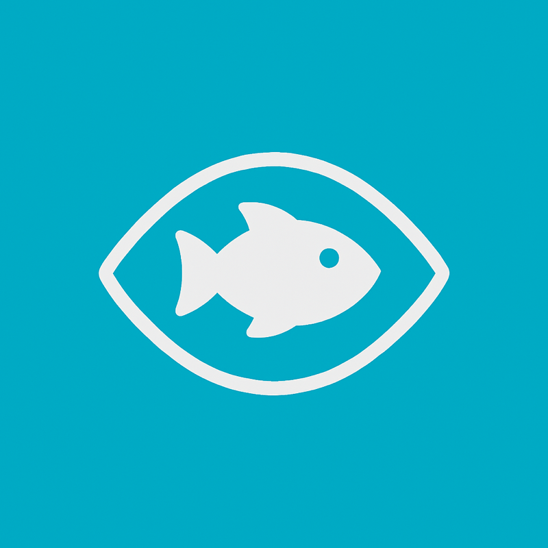

# MoView



MoView 是一个基于 Electron 的跨平台桌面守护程序：当你在玩游戏时，摄像头检测到有人靠近，会自动把前台切换回预设的工作软件，避免糟糕的“社死”时刻。该项目目前针对 macOS 与 Windows 进行优化，所有视觉识别均在本地执行。

## 功能亮点
- 本地化人体/人脸检测（默认集成 [`@vladmandic/human`](https://github.com/vladmandic/human)）。
- 内置安全面孔识别，可捕获多张“自己”的面孔并排除误触发。
- 通过帧间差分检测环境运动，先于人脸识别触发保护动作。
- 摄像头实时预览与检测置信度展示，可调阈值、连续帧判定与冷却时间。
- 基于黑/白名单的游戏识别，支持匹配窗口标题、进程名、Bundle ID。
- 可配置多个工作应用候选，若程序已启动则前置并最大化窗口（AppleScript / PowerShell + Win32）。
- 设置持久化（Electron Store），UI 中即可编辑。

## 快速开始
1. **安装依赖**
   ```bash
   npm install
   ```

2. **准备模型文件**
   - 下载 Human 的模型资源，可使用官方脚本或从已有项目复制。
   - 将模型放在 `public/human-models/`（开发时 Vite 会从该目录提供静态资源）。
   - 打包后模型会被复制到 `dist/renderer/human-models/`，供离线加载。

3. **开发模式**
   ```bash
   npm run dev
   ```
   该脚本会并行启动：
   - `tsc --watch`：编译 `main` 与 `preload`。
   - `vite`：启动 Renderer 开发服务器。
   - `electron`：在模型编译完成后自动拉起主程序。

4. **生产构建**
   ```bash
   npm run build
   npm run dist
   ```
   构建后的产物位于 `release/`，包含 macOS 与 Windows 双平台安装包。

5. **注册安全面孔**
   - 启动应用后在“设置 → 安全面孔”中输入昵称并点击“捕获安全面孔”。
   - 建议正面、侧面各捕获一张，用于在不同姿态下识别自己。

## 目录结构
```
├── docs/architecture.md   # 架构说明与路线图
├── src/
│   ├── main/              # Electron 主进程逻辑
│   ├── preload/           # Preload 桥接层
│   ├── renderer/          # React + Vite 前端
│   └── shared/            # 主 / 渲染进程共享类型
├── dist/                  # 编译输出
└── public/                # 静态资源（需手动创建 human-models）
```

## 配置与运行时行为
- **摄像头检测**：默认使用人脸 + 人体最大置信度作为最终分数，达到阈值即可认为检测到访客。阈值、连续帧判定、采样间隔与冷却时间均可通过 UI 调整。
- **安全面孔**：在“设置”面板中可捕获多张自身面孔，Human 会生成向量并存入 `moview-settings.json`，运行时若识别到安全面孔则不会因自身动作触发切换。
- **运动侦测**：帧间差分用于侦测门、身体等大幅运动，在识别访客前即可触发；灵敏度可调。
- **游戏判定**：黑名单命中即认为是游戏，白名单可覆盖黑名单用于直播/录屏等场景。匹配规则对窗口标题、进程名、Bundle ID、可执行路径做模糊匹配（大小写不敏感）。
- **上下文切换**：
  - macOS：先通过 AppleScript 激活既有进程并尝试最大化窗口，必要时再 `reopen`。
  - Windows：PowerShell + Win32 API (`ShowWindowAsync`, `SetForegroundWindow`) 将现有窗口前置，找不到进程时才启动。
  - 可配置多个候选，同时可指定平台进程名称提升命中率。
- **持久化**：所有配置存储在用户数据目录的 `moview-settings.json` 中（由 `electron-store` 管理）。

## 鸣谢

特别感谢 [@vladmandic](https://github.com/vladmandic) 提供的 [@vladmandic/human](https://github.com/vladmandic/human) 库，为 MoView 提供了强大的视觉识别能力；感谢ChatGPT为MoView的项目命名与图标设计做出贡献；感谢Codex为MoView开发提供了强大的AI辅助能力。